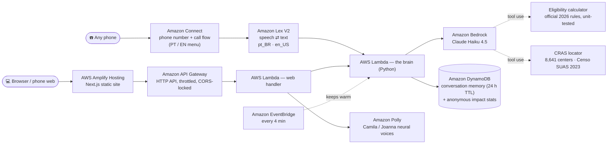

# Liga pra Mim — an AI helpline anyone can call

🇧🇷 [Leia em português](README.pt-BR.md)

**Liga pra Mim** ("Call for Me") is a phone line that helps low-income Brazilians find out which public benefits their family may be entitled to — and exactly where to go and what to bring. No app, no internet and no reading required: you call, you talk, it answers in plain Portuguese.

| Try it | |
|---|---|
| 📞 Call | **+1 (725) 333-6978** — press **2** for English |
| 🌐 Web (voice or text chat, same assistant) | https://main.d3197h98vf4n1z.amplifyapp.com |

**Category:** `#social-good` · **Lane:** `#community`

## Why

Brazil's social safety net is large — Bolsa Família, BPC (a minimum-wage income for elderly and disabled people), free electricity up to 80 kWh, the Pé-de-Meia student savings, free medicines — but the information lives on websites and apps. The people who need it most are often the ones least able to use them: elderly people, people who can't read well, people without data plans. Almost everyone, however, knows how to make a phone call.

## What it does

- **Understands the family** one question at a time: how many people live in the house, total income, ages, disability, pregnancy, students.
- **Applies the official 2026 rules in code, not in the model's head.** A tested eligibility calculator decides what is *likely*, *possible* or *unlikely* and estimates the monthly amount (e.g. Bolsa Família = R$ 600 + R$ 150 per child under 7 + R$ 50 per child 7–17…).
- **Tells you where to go**: searches the official list of **8,641 CRAS** (social assistance centers) in 5,526 cities and reads the address, a landmark ("near the São Raimundo Nonato church"), the phone number and opening days.
- **Stays safe**: never asks for ID numbers or passwords, never promises approval, warns about common scams, and gives emergency numbers first (180 for violence against women, 188 suicide prevention, 192 ambulance).
- **Speaks like a person on the phone**: short sentences, a slightly slower voice, and "Hmm, let me check…" when it needs a few seconds.

## Architecture



One brain, two doors: the phone call and the website run the same code, prompt, knowledge base and tools.

**Key decisions**

| Decision | Why |
|---|---|
| Rules in code, model for conversation | The model is good at understanding "I have three kids, 2, 4 and 9"; code is better at "is R$ 218.00 per person ≤ R$ 218?". The model calls the calculator as a tool and must repeat its result. |
| Numbers kept as digits for the voice | Letting the model spell numbers out made it say "one thousand and two" for a CRAS at number 2000. Polly reads digits correctly. |
| Claude Haiku 4.5 + warm-up | ~2–4 s per answer is acceptable on a call; a scheduled warm-up keeps the prompt cache and schema compilation hot so no caller waits 15 s. |
| US phone number | Claimed instantly and easy for international judges to call; a +55 number is on the roadmap. |
| No personal data | Nothing that identifies the caller is requested or stored. Conversation text expires after 24 h; only anonymous counters remain for the impact panel. |

## Evaluation

[`backend/evals/EVALUATION.md`](backend/evals/EVALUATION.md) runs **25 real conversations** (20 in Portuguese, 5 in English) against the live model and checks that the assistant called the right tool, understood the family, reached the result required by the official rules, and followed the safety rules. Plus **35 unit tests** for the calculator, the CRAS search and the handlers.

```bash
cd backend && python -m pytest -q          # unit tests, no AWS needed
python evals/run_eval.py                    # end-to-end, ~US$ 0.50 in Bedrock credits
```

## Built with a coding agent

The whole project — AWS account setup, infrastructure, backend, website and deploys — was built in conversation with **Claude Code** connected to the AWS account through the AWS CLI (`aws login`). The agent created the Amazon Connect instance and phone number, wrote the CDK stack and deployed it, researched and verified the 2026 benefit rules against official sources, built the CRAS dataset from the Censo SUAS, wrote the evaluation and fixed what it found.

## Repository layout

```
backend/app/       Lambda code: brain.py (prompt + tool loop), eligibility.py, tools.py,
                   lex_handler.py (phone), http_handler.py (web), knowledge.md, data/cras.json.gz
backend/tests/     unit tests          backend/evals/   end-to-end evaluation
backend/scripts/   build_cras.py (rebuilds the CRAS list from the Censo SUAS)
infra/             AWS CDK stack (TypeScript)
web/               Next.js site (static export) + deploy.sh
```

## Deploy your own

Requirements: an AWS account with Amazon Bedrock access to Claude, Node 22, Python 3.13, AWS CLI v2.

```bash
cp .env.example .env                        # fill in your account, Connect instance and site URL
cd infra && npm install && npx cdk deploy   # Lex bot, Lambdas, DynamoDB, API, call flow
cd ../web && npm install && bash deploy.sh  # builds the site and publishes it to Amplify
```

The Amazon Connect instance and phone number are created once in the console or CLI (see `PLANO.md`).

**Cost:** about US$ 0.30 per 5-minute call and ~US$ 0.01 per web message; hosting and storage fit in the free tier.

## Data sources

Benefit rules checked in September 2026 against gov.br (MDS, INSS, ANEEL, MEC, Ministry of Health) — full list at the end of [`knowledge.md`](backend/app/knowledge.md). CRAS list: Censo SUAS 2023 (MDS). Liga pra Mim gives guidance; only CRAS or INSS can confirm eligibility.

## Roadmap

A Brazilian (+55) number · WhatsApp voice notes · live municipal data from the MDS open API ("in your city, 54,596 families receive Bolsa Família") · partnerships with municipal CRAS teams.
