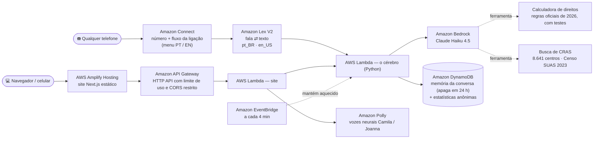

# Liga pra Mim — uma linha de ajuda com IA para qualquer telefone

🇺🇸 [Read in English](README.md)

O **Liga pra Mim** é uma linha telefônica que ajuda brasileiros de baixa renda a descobrir quais benefícios sociais a família pode ter, e exatamente onde ir e o que levar. Não precisa de aplicativo, internet nem saber ler: a pessoa liga, conversa e recebe a resposta em português simples.

| Experimente | |
|---|---|
| 📞 Ligue | **+1 (725) 333-6978**. Tecle **2** para inglês |
| 🌐 Site (chat por voz ou texto, a mesma assistente) | https://main.d3197h98vf4n1z.amplifyapp.com |

**Categoria:** `#social-good` · **Lane:** `#community`

## Por quê

A rede de proteção social do Brasil é grande: Bolsa Família, BPC, luz grátis até 80 kWh, Pé-de-Meia, remédios gratuitos. Mas a informação está em sites e aplicativos. Quem mais precisa costuma ser quem menos consegue usá-los: idosos, pessoas com pouca leitura, quem não tem pacote de dados. Quase todo mundo, porém, sabe fazer uma ligação.

## O que ele faz

- **Entende a família**, uma pergunta por vez: quantas pessoas moram na casa, renda total, idades, deficiência, gestação, estudantes.
- **Aplica as regras oficiais de 2026 em código, e não "de cabeça".** Uma calculadora testada decide o que é *provável*, *possível* ou *improvável* e estima o valor mensal (por exemplo, Bolsa Família = R$ 600 + R$ 150 por criança até 6 anos + R$ 50 por criança de 7 a 17…).
- **Diz aonde ir:** consulta a lista oficial de **8.641 CRAS** em 5.526 cidades e fala o endereço, um ponto de referência ("perto da Igreja São Raimundo Nonato"), o telefone e os dias de funcionamento.
- **É segura:** nunca pede CPF ou senha, nunca promete aprovação, alerta sobre golpes e dá primeiro os números de emergência (180, 188, 190, 192).
- **Fala como gente ao telefone:** frases curtas, voz um pouco mais lenta e "Hum, deixa eu ver aqui…" quando precisa de alguns segundos.

## Arquitetura



Um cérebro, duas portas: a ligação e o site usam o mesmo código, o mesmo prompt, a mesma base de conhecimento e as mesmas ferramentas.

**Decisões importantes**

| Decisão | Por quê |
|---|---|
| Regras no código, IA na conversa | A IA é boa em entender "tenho três filhos, de 2, 4 e 9 anos"; o código é melhor em "R$ 218,00 por pessoa é ≤ R$ 218?". A IA chama a calculadora como ferramenta e repete o resultado dela. |
| Números em algarismos para a voz | Quando a IA escrevia números por extenso, ela disse "mil e dois" para um CRAS no número 2000. O Polly lê algarismos corretamente. |
| Claude Haiku 4.5 + aquecimento | Respostas de 2 a 4 s são aceitáveis numa ligação; o aquecimento agendado mantém o cache do prompt ativo para ninguém esperar 15 s. |
| Número dos EUA | Liberado na hora e fácil para jurados internacionais ligarem; o número +55 está no roadmap. |
| Sem dados pessoais | Nada que identifique a pessoa é pedido ou guardado. O texto da conversa é apagado em 24 h; ficam só contadores anônimos para o painel de impacto. |

## Avaliação

O arquivo [`backend/evals/EVALUATION.md`](backend/evals/EVALUATION.md) roda **25 conversas reais** com a IA (20 em português e 5 em inglês) e confere se ela usou a ferramenta certa, entendeu a família, chegou ao resultado exigido pelas regras oficiais e respeitou as regras de segurança. Há ainda **35 testes unitários** da calculadora, da busca de CRAS e dos handlers.

```bash
cd backend && python -m pytest -q          # testes unitários, sem AWS
python evals/run_eval.py                    # ponta a ponta, ~US$ 0,50 em créditos do Bedrock
```

## Feito com um agente de programação

O projeto inteiro (configuração da conta AWS, infraestrutura, backend, site e publicação) foi construído em conversa com o **Claude Code**, conectado à conta AWS pela AWS CLI (`aws login`). O agente criou a central do Amazon Connect e o número, escreveu e publicou a stack CDK, pesquisou e conferiu as regras de 2026 em fontes oficiais, montou a base de CRAS a partir do Censo SUAS, escreveu a avaliação e corrigiu o que ela encontrou.

## Estrutura do repositório

```
backend/app/       código da Lambda: brain.py (prompt + ferramentas), eligibility.py, tools.py,
                   lex_handler.py (telefone), http_handler.py (site), knowledge.md, data/cras.json.gz
backend/tests/     testes unitários     backend/evals/   avaliação ponta a ponta
backend/scripts/   build_cras.py (reconstrói a lista de CRAS a partir do Censo SUAS)
infra/             stack AWS CDK (TypeScript)
web/               site Next.js (export estático) + deploy.sh
```

## Como publicar a sua versão

Requisitos: conta AWS com acesso ao Claude no Amazon Bedrock, Node 22, Python 3.13 e AWS CLI v2.

```bash
cp .env.example .env                        # preencha conta, instância do Connect e URL do site
cd infra && npm install && npx cdk deploy   # bot Lex, Lambdas, DynamoDB, API, fluxo da ligação
cd ../web && npm install && bash deploy.sh  # gera o site e publica no Amplify
```

A instância do Amazon Connect e o número são criados uma vez, pelo console ou pela CLI (veja o `PLANO.md`).

**Custo:** cerca de US$ 0,30 por ligação de 5 minutos e ~US$ 0,01 por mensagem no site. Hospedagem e armazenamento cabem no plano gratuito.

## Fontes de dados

Regras dos benefícios conferidas em setembro de 2026 no gov.br (MDS, INSS, ANEEL, MEC, Ministério da Saúde). A lista completa está no fim do [`knowledge.md`](backend/app/knowledge.md). Lista de CRAS: Censo SUAS 2023 (MDS). O Liga pra Mim orienta, mas não concede benefícios: quem confirma é o CRAS ou o INSS.

## Próximos passos

Número brasileiro (+55) · áudios de WhatsApp · dados oficiais do município pela API aberta do MDS ("na sua cidade, 54.596 famílias recebem Bolsa Família") · parcerias com equipes de CRAS das prefeituras.
